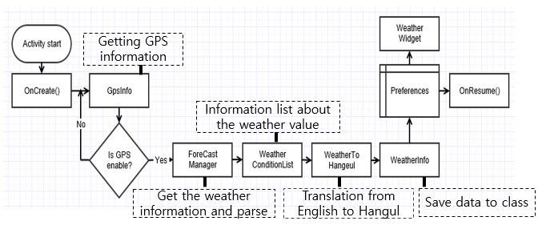
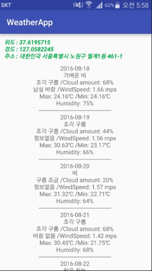
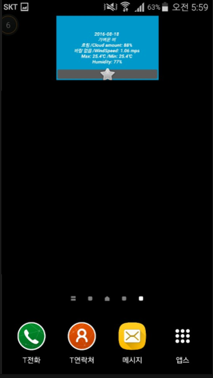

# 프로젝트 명 : Weatherapp
* GPS 날씨 정보 어플리케이션

## 개발 환경
* Android Studio

## 프로젝트 선정 배경
* 방학기간 동안 안드로이드 스터디를 하며 배웠던 내용을 바탕으로
 실제 프로젝트를 개발해보는 경험을 쌓기 위해 진행한 프로젝트다.
 프로젝트 구성이 어떻게 돼있으며, API를 사용하는 방법을 알아보기 위해 날씨앱을 제작하였다. 

## 프로젝트 설명
* 사용자의 GPS 좌표값을 가져와 위치를 한글로 변환하여 보여준다
 해당 좌표값을 OpenWeathermap api에 전달하고 해당 위치의 날씨 정보를 json타입으로 받아온다.
 받아온 데이터를 보기 쉽게 정리하여 출력해준다.
 또한 위젯을 추가하여 메인 화면에서도 볼 수 있다.

* Flow chart

    

* 어플리케이션 실행 화면

    

* 위젯 화면

    
